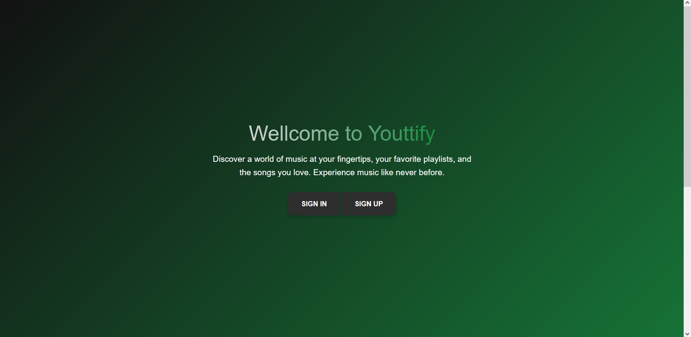
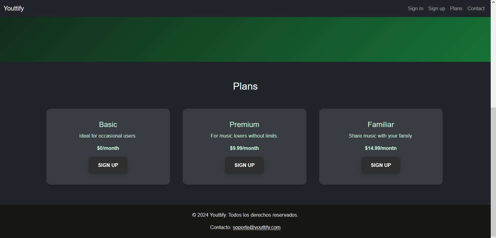
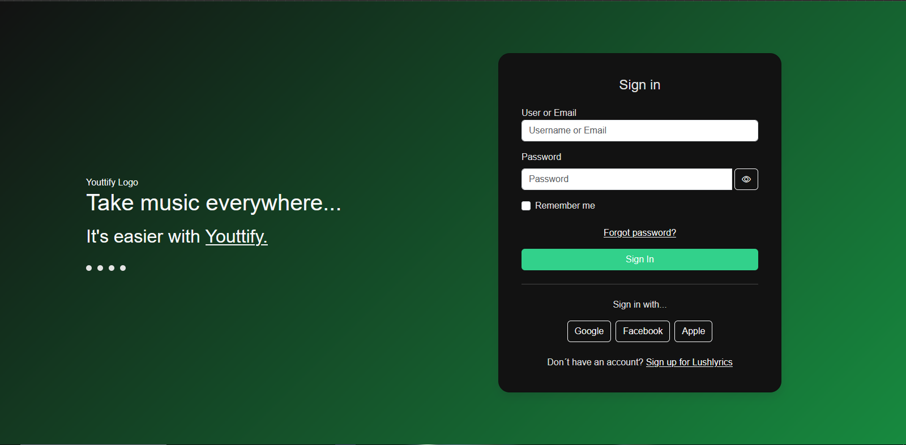
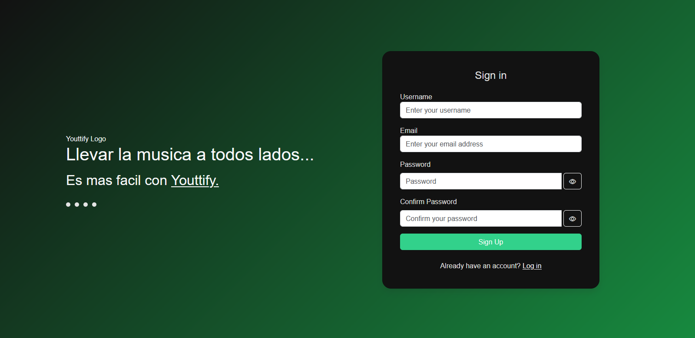
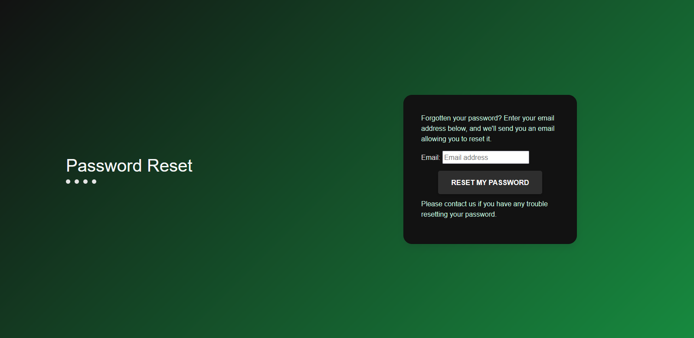
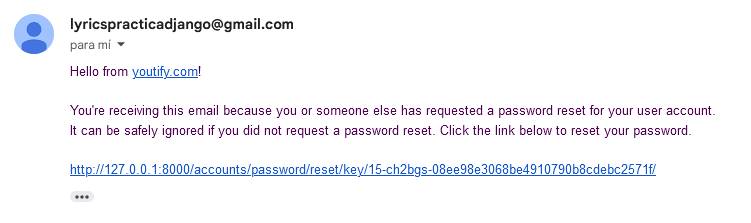
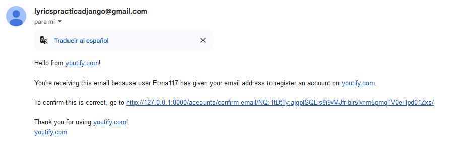

This repository is a copy of: https://github.com/mohammedwed/lushlyrics-webapp-django.git
Given the change in structure, create a new repository to avoid conflicts with git and not create a new .zip

## Setup

The first thing to do is to clone the repository:

```sh
$ git clone https://github.com/mohammedwed/lushlyrics-webapp-django.git
$ cd lushlyrics-webapp-django
```

Create a virtual environment to install dependencies in and activate it:

```sh
$ virtualenv2 --no-site-packages env
$ source env/bin/activate
```

Then install the dependencies:

```sh
(env)$ pip install -r requirements.txt
```
Note the `(env)` in front of the prompt. This indicates that this terminal
session operates in a virtual environment set up by `virtualenv2`.

Once `pip` has finished downloading the dependencies:
```sh
(env)$ cd spotify-clone-django
(env)$ python manage.py runserver
```
And navigate to `http://127.0.0.1:8000/`.

# Project Features

This project includes the following main features:

## Mainpage
The main page of the application displays a list of plans available, buttoms for login and sign up




## Login
The login functionality uses Django Allauth to handle user access.



## User Registration
New users can register using their email address.



## Password Recovery
Functionality to recover forgotten passwords with automated email delivery.




## Email Account Confirmation
The system uses Django Allauth to confirm accounts through a link sent via email.



